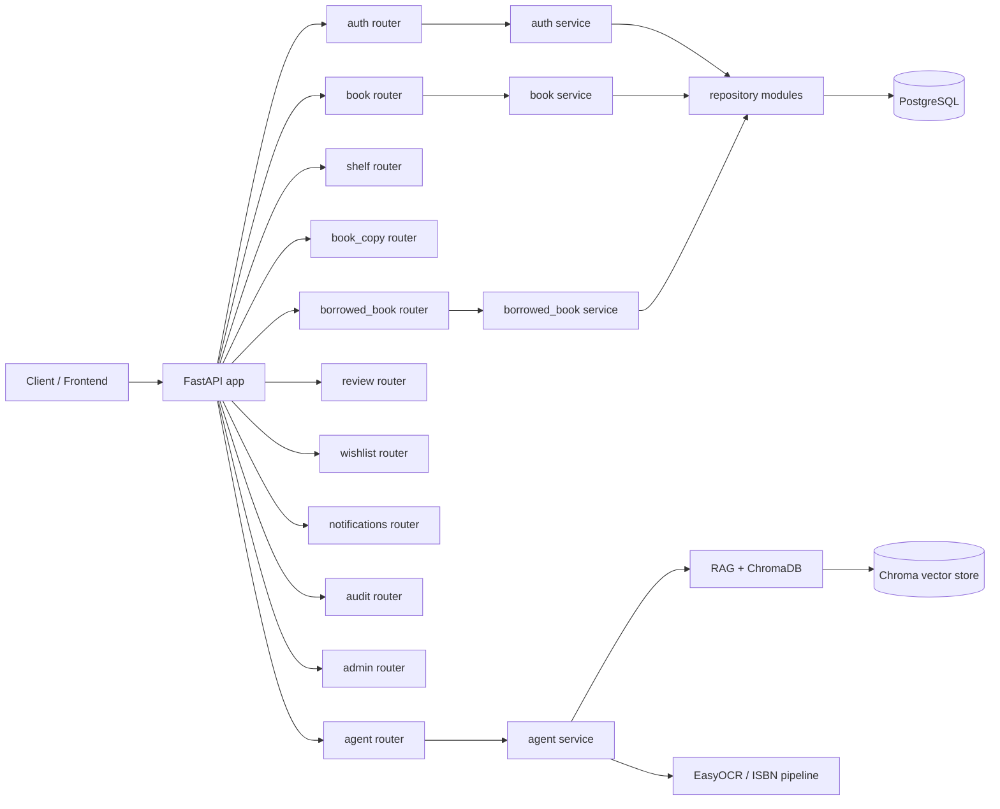
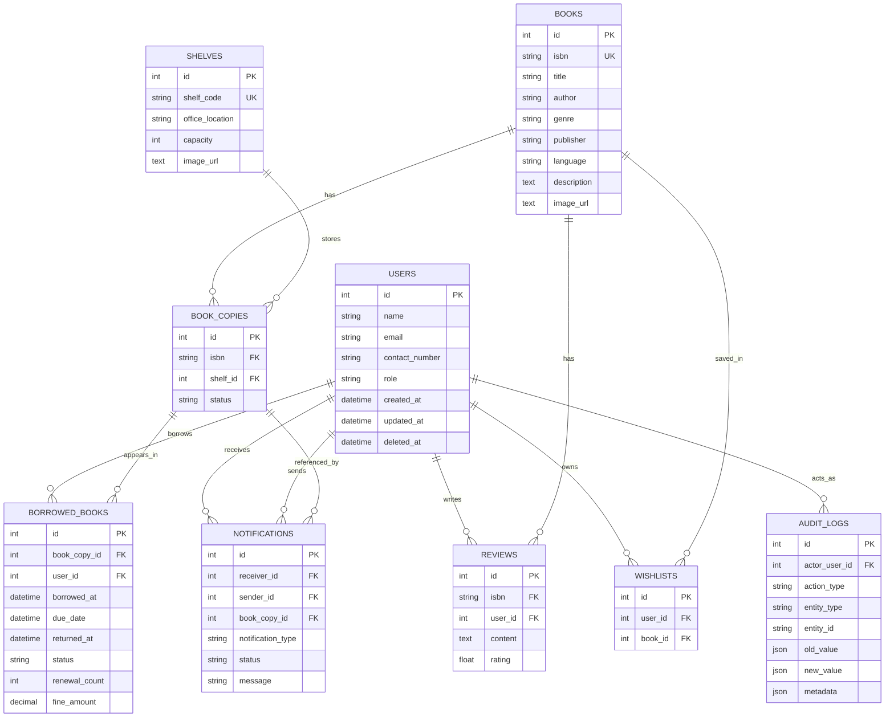

# Library Management Backend Walkthrough

## Project Overview

This project is a modular FastAPI backend for a library management system. It combines standard library operations such as authentication, books, shelves, borrowing, reviews, wishlists, notifications, admin workflows, and audit logging with an AI assistant that can answer library-related questions and search indexed documents.

The application is organized as a layered monolith:

1. API routers expose HTTP endpoints.
2. Service modules hold business rules and orchestration.
3. Repository modules talk to the database.
4. SQLAlchemy ORM models define the data layer.
5. The agent package adds an LLM-driven interface backed by tools, retrieval, and image/OCR pipelines.

## Technology Stack

- FastAPI for the HTTP API
- Uvicorn as the ASGI server
- SQLAlchemy 2.x with async sessions
- asyncpg for PostgreSQL access
- Alembic for database migrations
- Pydantic v2 and pydantic-settings for request and configuration models
- JWT and python-jose for authentication
- bcrypt for password hashing
- ChromaDB, LangChain, LangChain LiteLLM, sentence-transformers, and EasyOCR for the AI and retrieval layer
- Static file serving for uploaded images under the uploads path

## High-Level Architecture

## Application Entry Point

The application starts in [main.py](/home/adhilsalam/Library-management-backend/main.py). It creates the FastAPI app, registers middleware and exception handlers, and mounts all domain routers:

- auth
- books
- shelves
- agent
- book copies
- reviews
- borrowed books
- audit
- notifications
- admin
- wishlists

It also exposes a simple health endpoint and serves uploaded files from the uploads directory.

## Code Organization

The project follows a repeatable package structure for most business domains:

- router.py or router.py exposes FastAPI endpoints
- service.py contains business logic
- repo.py or repository.py handles persistence queries
- schemas.py or schema.py defines Pydantic request and response models

This pattern is repeated across auth, book, shelf, book_copy, borrowed_book, review, notifications, audit, wishlist, user, and admin.

## Request Flow

For a typical request the flow is:

1. A router receives the HTTP request and validates input with Pydantic.
2. The router injects an async SQLAlchemy session using get_db.
3. The service layer applies business rules, authorization checks, and workflow steps.
4. The repository layer performs the actual SQLAlchemy queries.
5. The service returns ORM objects or API-shaped dictionaries.
6. Middleware and exception handlers convert failures into consistent API responses.

Authentication-protected endpoints use JWT-based dependencies from auth.dependencies to resolve the current user.

## Data Layer

The shared ORM base is defined in [models/entity.py](/home/adhilsalam/Library-management-backend/models/entity.py). Every concrete entity inherits common fields:

- id
- created_at
- updated_at
- deleted_at

The database layer uses async SQLAlchemy in [database/connection.py](/home/adhilsalam/Library-management-backend/database/connection.py). It creates an async engine, exposes a request-scoped AsyncSession dependency, and uses Base.metadata.create_all for table creation support.

## Domain Model Summary

### User

The users table stores the system accounts. A user has a role of admin or employee, plus profile fields such as name, email, contact number, and password hash.

User relationships:

- one user can write many reviews
- one user can have many borrowed book records
- one user can own many audit logs as the actor
- one user can receive many notifications
- one user can send many notifications
- one user can have many wishlist entries

### Book

Book is the catalog-level record for a title. It stores ISBN, title, author, genre, publisher, language, description, and image URL.

Book relationships:

- one book can have many physical copies
- one book can have many reviews
- one book can have many wishlist entries

### Shelf

Shelf represents a physical storage location. It stores shelf code, office location, capacity, and an optional image.

Shelf relationships:

- one shelf can contain many book copies

### BookCopy

BookCopy is the physical inventory record for a book. It references a book by ISBN and a shelf by shelf_id.

It also stores a status such as AVAILABLE, BORROWED, LOST, or DAMAGED.

BookCopy relationships:

- many copies belong to one book
- many copies belong to one shelf
- one copy can appear in many borrowed book records over time
- one copy can be referenced by many notifications

### BorrowedBook

BorrowedBook stores the borrowing transaction history. It links a user to a copy and tracks borrowed_at, due_date, returned_at, renewal_count, fine_amount, and status.

This table is the main operational history for circulation.

### Review

Review links a user to a book ISBN with rating and free-form content.

### Wishlist

Wishlist is a user-book join table with a uniqueness constraint on user_id and book_id, preventing duplicate wishlist entries for the same pair.

### Notifications

Notifications stores user-facing alerts. It supports:

- receiver and sender users
- notification type
- notification status
- optional book copy linkage
- optional resolution timestamp

### AuditLog

AuditLog captures system actions such as create, update, delete, borrow, return, approve, reject, login, and logout. It stores:

- actor_user_id
- action_type
- entity_type
- entity_id
- old_value
- new_value
- metadata

This is a generic audit table rather than a strict foreign-key log of every entity.

## API Surface By Module

### Authentication

The auth routes provide login, signup, refresh token, current user lookup, and profile update. Login and signup both issue access and refresh tokens, and login also triggers due-date notification checks.

### Books

The book API supports catalog creation, retrieval, update, deletion, ISBN lookup, genre search, shelf lookup for a title, and an API lookup by ISBN. Book creation can persist an uploaded image and store the generated file path.

### Borrowed Books

The borrowed book API supports borrowing a copy, returning a copy, renewing a borrow, listing borrowed books with filters, and retrieving borrow details by borrow record or by user.

### Agent

The agent API exposes prompt processing, streaming responses, document uploads for retrieval, and cover uploads for ISBN extraction.

Other routers cover shelves, reviews, notifications, admin flows, audit logs, and wishlists with the same service and repository pattern.

## AI And Retrieval Subsystem

The agent package is a separate internal subsystem designed for library assistance. It is composed of:

- library_agent.py for the LangChain agent orchestration
- tools.py for tool factories that expose live database and document capabilities
- rag_service.py for document chunking, embedding, vector storage, and retrieval
- isbn/pipeline.py and related modules for ISBN and cover processing
- agent/config.py for model, collection, and upload configuration

The agent can:

- search books in the live database
- locate shelves for a title or ISBN
- retrieve borrow history
- search policy documents through ChromaDB-backed RAG
- process uploaded book cover images and extract ISBN data

The retrieval layer uses sentence-transformers embeddings, ChromaDB collections, and LangChain tool wrappers. This means the agent can answer two kinds of questions:

1. Live operational queries from the PostgreSQL database
2. Document-grounded questions from indexed policy or knowledge documents

## Storage And Deployment Notes

The repository includes a Dockerfile and compose.yaml for containerized deployment, plus Alembic migrations for schema evolution. Uploaded media is stored under uploads and exposed through FastAPI static files. A local chroma_db directory is also present for vector store persistence.

## ER Diagram

## Key Technical Details

- The backend is async end to end for database operations.
- Authentication is token-based and uses password hashing for stored credentials.
- Domain modules are isolated by feature, which keeps the codebase maintainable as the application grows.
- Audit logging is built into critical mutating flows such as signup, login, book creation, and borrow or return actions.
- The AI assistant is not a separate service; it is integrated into the same backend and reuses the application database session where needed.
- The architecture supports both classic REST operations and AI-assisted workflows in one system.

## Suggested Reading Order

If you want to understand the codebase in depth, read it in this order:

1. [main.py](/home/adhilsalam/Library-management-backend/main.py)
2. [database/connection.py](/home/adhilsalam/Library-management-backend/database/connection.py)
3. [models/entity.py](/home/adhilsalam/Library-management-backend/models/entity.py)
4. [models/user.py](/home/adhilsalam/Library-management-backend/models/user.py)
5. [models/book.py](/home/adhilsalam/Library-management-backend/models/book.py)
6. [models/book_copy.py](/home/adhilsalam/Library-management-backend/models/book_copy.py)
7. [models/borrowed_book.py](/home/adhilsalam/Library-management-backend/models/borrowed_book.py)
8. [auth/service.py](/home/adhilsalam/Library-management-backend/auth/service.py)
9. [book/service.py](/home/adhilsalam/Library-management-backend/book/service.py)
10. [borrowed_book/service.py](/home/adhilsalam/Library-management-backend/borrowed_book/service.py)
11. [agent/library_agent.py](/home/adhilsalam/Library-management-backend/agent/library_agent.py)
12. [agent/rag_service.py](/home/adhilsalam/Library-management-backend/agent/rag_service.py)

## Summary

This backend is a feature-organized FastAPI application backed by an async PostgreSQL data layer and a separate AI assistant subsystem. Its core design is a clean router-service-repository split, with rich relational data around users, books, shelves, copies, borrowing, reviews, notifications, audit logs, and wishlists. The AI layer adds semantic document retrieval and ISBN extraction without replacing the transactional library workflow.
